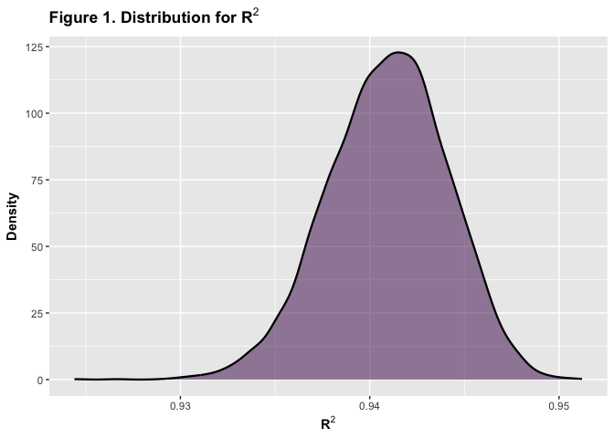
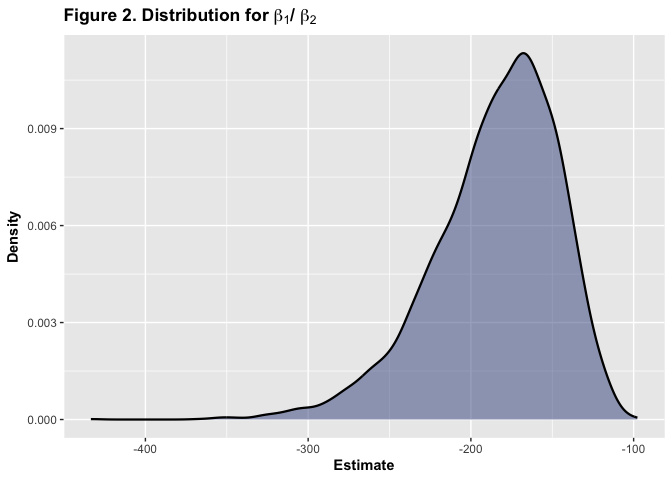

Homework 6
================
Matariya Rattanapan
2025-12-03

## Problem 1

N/A

## Problem 2

#### Cleaning up `weather_df` data, fitting linear model, and bootstrapping

``` r
weather_df =
  weather_df |> 
  drop_na(tmax, tmin, prcp)

#Fitting linear model

fit = lm(tmax ~ tmin + prcp, data = weather_df)

#Bootstrapping
weather_bootstrap =
  weather_df |> 
  modelr::bootstrap(n = 5000) |> 
  mutate(
    models = map(strap, \(df) lm(tmax ~ tmin + prcp, data = df)),
    glance = map(models, broom::glance),
    tidy   = map(models, broom::tidy)
  )

#Getting bootstrapped r2
r2 =
  weather_bootstrap |> 
  unnest(glance) |> 
  select(.id, r.squared)

#Getting beta1 and beta2

betas =
  weather_bootstrap |> 
  unnest(tidy) |> 
  filter(term %in% c("tmin", "prcp")) |> 
  select(.id, term, estimate) |> 
  pivot_wider(
    names_from = term,
    values_from = estimate
  ) |> 
  rename(
    beta1 = tmin,
    beta2 = prcp
  ) |> 
  mutate(
    beta_ratio = beta1/beta2
  )

#Combining estimates into one df
weather_estimates =
  left_join(r2, betas, by=".id")
```

#### Plotting the distribution of estimates

``` r
#R2 Distribution
weather_estimates |> 
  ggplot(aes(x = r.squared)) +
  geom_density(linewidth = 0.8, fill = "#440154", alpha = 0.5) +
  labs(
    title = expression(bold("Figure 1. Distribution for R"^2)),
    x = expression(bold("R"^2)),
    y = expression(bold("Density"))
  )
```

<!-- -->

``` r
#Beta Distribution
weather_estimates |> 
  ggplot(aes(x = beta_ratio)) +
  geom_density(linewidth = 0.8, fill = "#3b528b", alpha = 0.5) +
  labs(
    title = expression(bold("Figure 2. Distribution for " *beta[1]* "/ " *beta[2])),
    x = expression(bold("Estimate")),
    y = expression(bold("Density"))
  )  
```

<!-- -->

- The distribution for R<sup>2</sup> is relatively normally skewed and
  symmetric. The data is highly concentrated near 0.94 with little
  fluctuation in the sample.
- The distribution for β<sub>1</sub> /β<sub>2</sub>, (`tmin`/`prcp`) is
  noticeably right-skewed (much of the data is concentrated -250 and
  onward). Large negative outliers may be attributed to precipitation
  `prcp` being small and near zero, thereby leading to a longer left
  tail.

#### Calculating 2.5% and 97.5% quantiles and providing a 95% confidence interval

``` r
weather_estimates |> 
  summarize(
    r2_lower  = quantile(r.squared, 0.025),
    r2_upper  = quantile(r.squared, 0.975),
    betar_lower  = quantile(beta_ratio, 0.025),
    betar_upper  = quantile(beta_ratio, 0.975)
  ) |> 
  knitr::kable()
```

|  r2_lower |  r2_upper | betar_lower | betar_upper |
|----------:|----------:|------------:|------------:|
| 0.9344957 | 0.9467211 |   -274.7945 |   -125.4836 |

- The 95% confidence interval for R<sup>2</sup> is (0.93, 0.95), which
  is very narrow. This supports the model’s ability to strongly explain
  variation in temperature.
- The 95% confidence interval for β<sub>1</sub> /β<sub>2</sub> is
  (-274.79, -125.48), a much wider interval. There is more variability
  likely due to precipation `prcp` being a smaller and in the
  denominator.

## Problem 3

#### Importing data and cleaning up data

``` r
birthweight =
  read_csv("data/birthweight.csv", na = c("NA", ".", "")) |> 
  mutate(
    babysex = factor(babysex),
    frace = factor(frace),
    malform = factor(malform),
    mrace = factor(mrace),
  )

#Checking for any missing data
birthweight |> 
  summarize(across(everything(), \(x) sum(is.na(x))))
```

    ## # A tibble: 1 × 20
    ##   babysex bhead blength   bwt delwt fincome frace gaweeks malform menarche
    ##     <int> <int>   <int> <int> <int>   <int> <int>   <int>   <int>    <int>
    ## 1       0     0       0     0     0       0     0       0       0        0
    ## # ℹ 10 more variables: mheight <int>, momage <int>, mrace <int>, parity <int>,
    ## #   pnumlbw <int>, pnumsga <int>, ppbmi <int>, ppwt <int>, smoken <int>,
    ## #   wtgain <int>

- There is no presence of missing data, so we will move forward with
  building our model.

#### Building Main Regression Model for Birthweight

``` r
birthweight_model =
  lm(bwt ~ babysex + frace + gaweeks + malform + momage + mrace + ppbmi + smoken, data = birthweight)

tidy(birthweight_model) |> 
  knitr::kable()
```

| term        |     estimate |  std.error |   statistic |   p.value |
|:------------|-------------:|-----------:|------------:|----------:|
| (Intercept) |  657.0137157 | 101.442294 |   6.4767238 | 0.0000000 |
| babysex2    |  -92.7081359 |  13.400001 |  -6.9185169 | 0.0000000 |
| frace2      |  -75.5598109 |  74.395036 |  -1.0156566 | 0.3098497 |
| frace3      |  -21.5603426 | 111.906674 |  -0.1926636 | 0.8472315 |
| frace4      |  -70.4863308 |  72.098983 |  -0.9776328 | 0.3283106 |
| frace8      |  -29.4717167 | 119.566074 |  -0.2464890 | 0.8053154 |
| gaweeks     |   59.3604446 |   2.162233 |  27.4533101 | 0.0000000 |
| malform1    |   -3.4351818 | 114.009351 |  -0.0301307 | 0.9759642 |
| momage      |    0.0118099 |   1.871836 |   0.0063093 | 0.9949663 |
| mrace2      | -217.4430531 |  74.329678 |  -2.9253867 | 0.0034582 |
| mrace3      | -123.9021183 | 116.021443 |  -1.0679243 | 0.2856142 |
| mrace4      | -128.5936224 |  72.538100 |  -1.7727735 | 0.0763366 |
| ppbmi       |   16.2229571 |   2.133302 |   7.6046231 | 0.0000000 |
| smoken      |  -11.1959307 |   0.935526 | -11.9675251 | 0.0000000 |

- My modeling process derives from previous research and literature on
  factors influencing birthweight.
  - `babysex` was selected since male infants generally may have higher
    average birthweights compared to female infants
